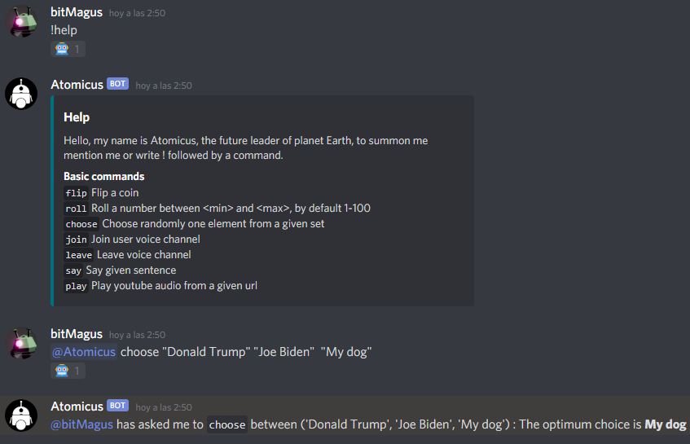

# Discord bot
Simple discord bot using discord.py that can speak and play some youtube music.

## Instructions:

1- pip install -r requirements.txt  
2- install ffmpeg on 'lib' directory. https://ffmpeg.org/  
3- create file .env with: DISCORD_TOKEN={YOUR TOKEN}  

Execute run.py to initialize the bot 

